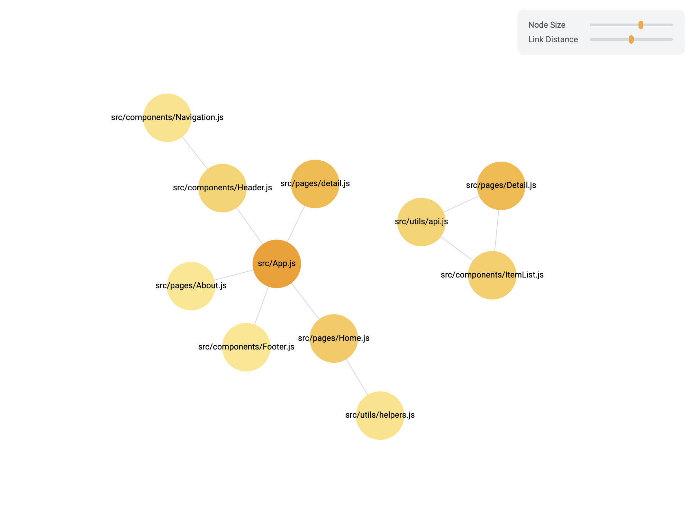

# DepScope

**DepScope** is a module that analyzes and visualizes module dependencies in JavaScript projects. It identifies interdependent modules using `import` and `require` statements and generates a graph to illustrate these relationships. By providing a visualization of module dependencies, it offers insights for building a more structured codebase.

## Features

- **JS, JSX, TS, TSX Support**: Works seamlessly with projects using JavaScript, JSX, TypeScript, and TSX. Visualizes module dependencies by analyzing `import` and `export` statements, providing a comprehensive graph view.
- **Import & Require Support**: Analyzes both `import` and `require` statements to capture all dependencies across ES and CommonJS modules.
- **Flexible Folder Input**: Input folders as an array to scan one or multiple directories, making it easy to analyze entire projects or specific subfolders.
- **Dynamic Node Color**: Node colors vary based on module size, offering a quick visual indication of module weight. Hover over a node to view precise module size information.
- **Interactive Graph Customization**: Adjust node size and link distance with intuitive sliders. Supports drag-and-drop functionality to explore dependencies interactively.

## Preview



## Installation

```bash
npm install dep-scope
```

or

```bash
yarn add dep-scope
```

## How to use (with example)

**Step 1.** Install `dep-scope`.

**Step 2.** Run the command, `npx dep-scope` with input array. You can put folder names that you want to scan. For example, to analyze files within the `./src` folder, use:

```bash
npx dep-scope '["./src"]'
```

To explore multiple folders, specify them as follows:

```bash
npx dep-scope '["./src", "./dist"]'
```

**Step 3.** After running the command, you can see the results at `localhost:5001`.

## Contributing

If you'd like to contribute, feel free to submit a pull request or open an issue. Feedback to improve the project is always welcome!

## Docs

Find detailed documentation and updates in the <a href="https://dep-scope.vercel.app/" target="_blank">Docs</a>.

## License

This project is licensed under the **MIT License**.
